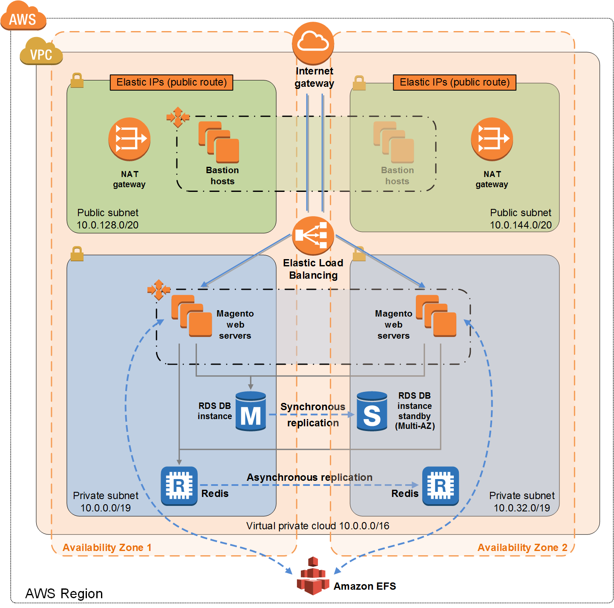

# Magento on AWS

## Magento on the AWS Cloud. Quick Start
* [Quick Start Reference Deployment](https://docs.aws.amazon.com/quickstart/latest/magento/welcome.html?shortFooter=true)
* [Overview](https://docs.aws.amazon.com/quickstart/latest/magento/overview.html?shortFooter=true)
* [Architecture](https://docs.aws.amazon.com/quickstart/latest/magento/architecture.html?shortFooter=true)
* Architecture Graph

* [Design Considerations](https://docs.aws.amazon.com/quickstart/latest/magento/design.html?shortFooter=true)
* [Deployment Scenarios](https://docs.aws.amazon.com/quickstart/latest/magento/scenarios.html?shortFooter=true)
* [Deployment Steps](https://docs.aws.amazon.com/quickstart/latest/magento/deployment.html?shortFooter=true)
* [Troubleshooting](https://docs.aws.amazon.com/quickstart/latest/magento/troubleshooting.html?shortFooter=true)
* [Security](https://docs.aws.amazon.com/quickstart/latest/magento/security.html?shortFooter=true)
* [Additional Resources](https://docs.aws.amazon.com/quickstart/latest/magento/resources.html?shortFooter=true)
* [Document Revisions](https://docs.aws.amazon.com/quickstart/latest/magento/revisions.html?shortFooter=true)

## Dependency on other templates

### VPC Stack
* [quickstart-aws-vpc on github](https://github.com/aws-quickstart/quickstart-aws-vpc)
* [template](https://github.com/aws-quickstart/quickstart-aws-vpc/blob/master/templates/aws-vpc.template)
* [AWS Deployment Guide](https://docs.aws.amazon.com/quickstart/latest/vpc/welcome.html)

### Bastion Stack
* [quickstart-linux-bastion on github](https://github.com/aws-quickstart/quickstart-linux-bastion)
* [template](https://github.com/aws-quickstart/quickstart-linux-bastion/blob/master/templates/linux-bastion.template)
* [AWS Deployment Guide](https://docs.aws.amazon.com/quickstart/latest/linux-bastion/welcome.html)

### Bastion Stack
* [quickstart-linux-bastion on github](https://github.com/aws-quickstart/quickstart-linux-bastion)
* [template](https://github.com/aws-quickstart/quickstart-linux-bastion/blob/master/templates/linux-bastion.template)
* [AWS Deployment Guide](https://docs.aws.amazon.com/quickstart/latest/linux-bastion/welcome.html)